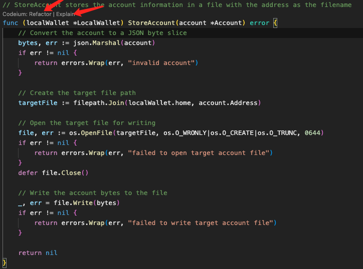

# 使用VSCode与Codeium AI增强编码体验

[VSCode](https://code.visualstudio.com/) 是一款灵活且具有广泛扩展生态系统的流行源代码编辑器。通过集成Codeium AI，一种先进的语言模型，您可以直接在VSCode中利用强大的人工智能功能。本指南将带您逐步了解如何设置和使用VSCode与Codeium AI，以提升编码效率。

## 先决条件

在开始之前，请确保满足以下先决条件：

- 在您的计算机上安装了[VSCode](https://code.visualstudio.com/)。
- 在VSCode中安装了Codeium AI扩展（请参考[官方文档](https://codeium.dev/)中的安装说明）。

## 入门指南

1. 打开您的计算机上的VSCode。

2. 从VSCode扩展商店安装Codeium AI扩展。

3. 打开一个项目或在VSCode中创建一个新项目。

4. 配置Codeium AI扩展：
   - 打开VSCode设置（`文件 -> 首选项 -> 设置`，或按下`Ctrl + ,`）。
   - 搜索"codeium"以找到Codeium AI扩展的设置项。
   - 根据您的喜好调整设置，例如模型选择、自动完成行为等。

5. 使用Codeium AI进行编码：
   - 在代码文件中键入时，Codeium AI将提供AI辅助建议，包括自动完成、代码片段和代码纠正等。
   - 注意AI辅助建议，并利用它们加速您的编码过程。
   - Codeium AI可以根据代码上下文、先前行和常见编程模式提供建议。

6. 利用高级功能：
   - 使用Codeium AI生成代码：如果您需要生成代码片段或模板，可以利用Codeium AI快速生成各种编程语言或框架的样板代码。
   - 获取代码解释：如果遇到陌生的代码或想要理解特定概念，您可以向Codeium AI请求解释或澄清。只需选择代码或将光标放在相关行上，然后访问适当的Codeium AI命令以获取详细解释。

7. 探索其他功能和命令：
   - 熟悉可用的Codeium AI命令和快捷键。这些命令可能包括用于代码自动完成、生成代码片段或获取代码解释的命令。
   - 参考Codeium AI扩展文档以获取全面的命令列表和用法说明。

## 实践

Codeium VSCode插件支持两种使用模式:

- 通过内置Prompt命令使用
- 通过插件提供的对话框使用

### 使用内置Prompt命令

内置Prompt命令(**默认没有单元测试，需通过对话框生成**)已经集成到插件内部，包括:



1. Refactor


Prompt主要包括:

a. 添加注释

```text
Refactor function: init (app.go:222:0-:229:1)

Add comments and docstrings to the code
```

b. 代码优化

```text
Refactor function: init (app.go:222:0-:229:1)

Make this faster and more efficient
```

c. 查验bug并修复

```text
Refactor function: init (app.go:222:0-:229:1)

Check for bugs such as null pointer references, unhandled exceptions, and more. If you don't see anything obvious, reply that things look good and that the user can reply with a stack trace to get more information.
```

d. 添加Log

```text
Refactor function: init (app.go:222:0-:229:1)

Add logging statements so that it can be easily debugged
```

e. 添加Print

```text
Refactor function: init (app.go:222:0-:229:1)

Add print statements so that it can be easily debugged
```

f. 修正代码

```text
Refactor function: init (app.go:222:0-:229:1)

Clean up this code by standardizing variable names, removing debugging statements, improving readability, and more. Explain what you did to clean it up in a short and concise way.
```

2. Explain: 详细解释方法

Prompt为:

```text
Explain function: NewAccountKeeper (keeper.go:72:0-:97:1)
```


 其中，内置Prompt命令使用方式也有两种:

1. 点击编辑器命令，针对某一方法使用


2. 选择代码块后，右键选择Prompt命令


### 使用对话框

有效Prompt用法举例如下:

#### 1. 生成单元测试

```text
Test function: init (app.go:222:0-:229:1)
Generate unit tests so it can be well tested. Show any potential bugs as well.
```

此命令将针对**当前vscode窗口文件app.go 从222行到229行的代码**，生成单元测试，并且展示任何潜在的Bug.


Tips:

1. 保持单个函数功能单一，生成的单元测试将更加准确，可直接使用
2. 对于涉及系统调用、业务逻辑复杂的方法，需要手动修改部分内容

## 有效使用的技巧

- 尝试不同的AI模型：Codeium AI提供了在各种代码库上训练的不同语言模型。尝试不同的模型，找到适合您编码风格和需求的模

型。

- 审查和验证AI建议：尽管Codeium AI可以提供有用的建议，在将其应用于代码库之前，审查和验证建议非常重要。确保建议符合您的编码标准和项目要求。
- 提供具体上下文：当向Codeium AI请求代码自动完成或解释时，尽可能提供尽可能具体的上下文，以获得准确和相关的建议或解释。
- 合作与知识分享：如果您发现有用的AI辅助编码技巧或有帮助的AI生成代码片段，请考虑与开发者社区分享您的发现。合作学习可以使每个人受益。

## 结论

使用VSCode与Codeium AI可以显著提升您的编码体验，借助人工智能的力量实现代码自动完成、生成和解释。通过将人工智能辅助融入您的工作流程，您可以加快开发速度、提高代码质量，并探索新的编码模式和技术。尝试Codeium AI扩展，探索其功能，并根据需要进行适应。
