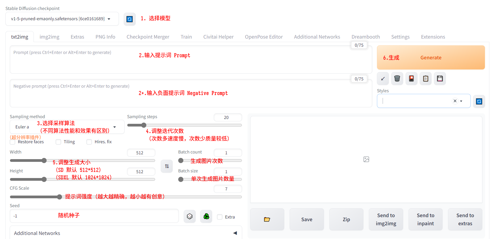
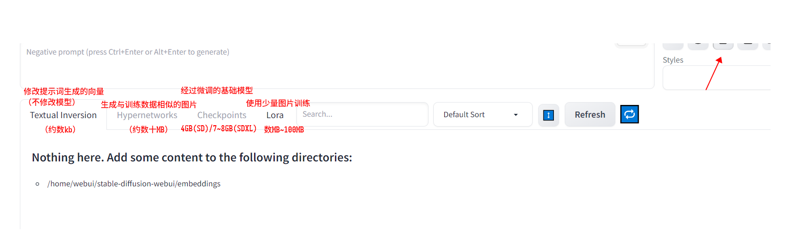

# Stable Diffusion

## 基本信息

- 简明算法原理：
    - 任何图片经过不断模糊、扩散后都可以变成一块完全的噪点图
    - 将这个模糊过程反向，通过算法猜测一张噪点图由什么图生成，亦即【降噪】。
    - 将降噪推理过程通过一定数学结构压缩，利用提示词指引猜测和还原的方向，即是扩散模型的原理。
- 最低硬件需求：
    - SD：4GB 显存/实例
    - SDXL：8GB 显存/实例
    - 插件将增加显存占用
    - 出图速度与显卡性能成正比
- 组成部分：
    - 基础模型 Checkpoint（微调过的完整模型数据（通常方法是 Dreambooth），SD 标准版约 3~4 GB，SDXL 约 6~8 GB）
        - Textual Inversion（提示词向量化算法优化，数 KB）
        - Hypernetwork（利用神经网络生成相似风格/脸型，数十 MB）
        - LoRa（不修改模型本身的低秩训练微调数据，数十 MB）
    - 调用程序/UI
        - 常见的有 A1111 web-ui，ConfyUI 等
        - 功能性插件（civitai helper 等）
    - 功能性插件
        - ControlNet 控制图片生成功能，每个功能对应约 1.5 GB 额外模型文件
        - 超分辨率放大图片
        - 其他功能拓展插件（训练模型、生成视频等）

## 使用流程

- **运行 Docker 镜像**
    - 基于 nvidia/cuda:12.2.0-runtime-ubuntu22.04 镜像
    - 启动参数：`docker run -v [挂载模型存放目录] -p [宿主机端口]:7860 --name [名称] --gpus [指定宿主机 GPU] -d [基础镜像名]`
- **安装**
    - 进入镜像：`docker exec -it [容器名] bash`
    - 安装依赖：`apt update & apt install git wget python3 python3-venv`
    - **创建并切换为非 root 用户**：``adduser [新用户名] & usermod -aG sudo [新用户名] & su - [新用户名] ``
    - 获取程序文件：`git clone https://www.github.com/AUTOMATIC1111/stable-diffusion-webui,git`
    - 在文件目录下运行安装脚本：``$ ./webui.sh --listen --enable-insecure-extension-access``
        - ``--listen`` = 开放外网监听
        - ``--enable-insecure-extension-access`` = 开放 webui 页面内插件管理功能
- 界面：
    - 

- **加载模型**
    - 加载 Checkpoint（约 3 GB）
        - 首次安装模型是会自动从 Huggingface 上下载大小约 3.5GB 的默认 Checkpoint
        - 需通过其他程序外方式下载文件并放置于`安装目录/models/Stable-diffusion`，或启动时通过命令行指定的其他目录下
        - 可在程序运行期间放置新模型文件，页面上有刷新按钮

- **输入 Prompt**
  - 正面 / 负面 Prompt，以逗号分隔
  - Prompt 将通过词义分隔过程转变成向量，输入模型（与 LLM 类似）
  - 通常来说 Prompt 数量越多，效果越好，但也可能出现过拟合的情况
- **调整输出参数**
  - 生成图大小（长、宽）：默认 512 * 512，训练数据图亦为该大小
  - 迭代次数（Steps）：次数高耗时长，次数低可能导致质量差（糊、没画完），默认 20
  - 采样算法：图片降噪还原过程中使用的算法，不同采样算法的性能及表现有一定差别。
  - 随机种子
  - 生成次数、张数（可以一次生成多张图、连续生成等）
- 额外调整：
    - 
    - Textual Inversion、Hypernetworks 可在 webui 中直接训练，训练方法参照后文（TBD）
    - 上述微调数据在模型分享平台上均有下载
- **生成**
  - 4090 显卡在标准生成参数下，迭代速度约为 20 次/秒。
  - 输出图片默认保存在相应目录

## ControlNet 插件：以各种方式控制生成图的细节

- 使用流程（以 A1111 web-ui 为例）：
  - 安装插件
    - ControlNet 本身亦是模型，在不同的 UI 上有不同的应用方法；
      - 如同 Stable Diffusion 模型拥有不同的社区 UI 实现一样；
    - 安装过程通常与调用程序相关，例如 A1111 webui 提供界面内可视化一键安装方式
  - 下载插件使用的转换模型（每个功能对应约 1.45GB 体积的模型文件）
  - 输入 Prompt、生成参数等基本信息
  - 在 ControlNet 选项栏中选择【Enabled】
  - 选择需要使用的功能，将会自动匹配预处理器（Preprocessor）及功能模型
  - 输入单张图片或图片集
    - 点击中间的火花图标，将对单张图片进行预处理，其结果显示在右侧
  - 调整 ControlNet 相关参数
    - 权重（默认 1）
    - 在迭代过程的哪一部分介入控制（百分比数，默认全程）
  - 依照正常流程生成图片

- 功能演示：
  - Canny：边缘检测生成
      - 输入图：
      - 
      - Canny 边缘检测预处理器检测结果（模型约 200MB）： 
      - 
      - 生成结果：
      - 
  - Openpose：姿态识别
      - 输入图：
      - 
      - Openpose 姿态检测预处理器：
      - 
      - 输出结果：
      - 
      - 注意：Openpose 对深度和前后遮挡关系的理解并不充分，复杂场景下可能会出现透视错误等问题。

## TODO：

- Stable Diffusion on Docker
  - [AbdBarho/stable-diffusion-webui-docker: Easy Docker setup for Stable Diffusion with user-friendly UI (github.com)](https://github.com/AbdBarho/stable-diffusion-webui-docker)
- 研究模型与插件之间的互动、插件容器化
  - 算力、实例扩展
  - 扩展 kubebb component 组件生态
- gRPC / REST API
  - [hafriedlander/stable-diffusion-grpcserver: An implementation of a server for the Stability AI Stable Diffusion API (github.com)](https://github.com/hafriedlander/stable-diffusion-grpcserver)